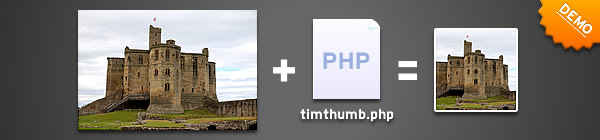
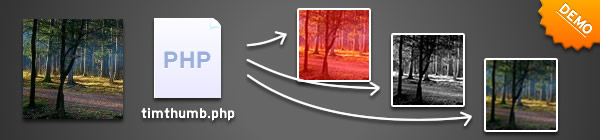

# modularavel/imgenerator

Dynamically image resizes by url parameters... fast and easy to use and/or customize.

## Server Requirements
This should go without saying really but TimThumb requires PHP and the GD image library. These are really really common so you shouldn’t have any problems. If you find yourself without these installed then ask your webhost and many will install the software for you – if they don’t do the installation it’s probably worth considering a new host.

## File Permissions
Some web hosts won’t execute PHP code if it sits in directories that have permissions set to 777. So make sure that any directories ‘above’ the timthumb.php file are set to a normal level of permissions (644 is good).

## Image Formats
Make sure that the images are one of .JPG, .JPEG, .GIF, or .PNG, or they won’t be resized!

## Ensure if the cache/index.html empty file exists
To prevent the cache files from being browsable, an index.html file is created in the cache directory. This file should have it’s permissions set to 666

## Installation

You can install the package via composer:

```bash
composer require modularavel/imgenerator
```

You can publish the config file with:

```bash
php artisan vendor:publish --tag="imgenerator-config"
```

This is the contents of the published config file:

```php
return [
    'source' => [
        'filesystem' => env('MODULARAVEL_IMGENERATOR_SOURCE_FILESYSTEM', 'public'), // Options: "local", "public", "s3"
    ],
    'cache' => [
        'folder' => env('MODULARAVEL_IMGENERATOR_CACHE_FOLDER', '/cache'),
        'prefix' => env('MODULARAVEL_IMGENERATOR_CACHE_PREFIX', 'cache_'),
        'filesystem' => env('MODULARAVEL_IMGENERATOR_CACHE_FILESYSTEM', 'local'), // Options: "local", "public", "s3"
    ],
    'allow_external_sites' => env('MODULARAVEL_IMGENERATOR_ALLOW_EXTERNAL_SITES', true),
    'allow_all_external_sites' => env('MODULARAVEL_IMGENERATOR_ALLOW_ALL_EXTERNAL_SITES', true),
    'allowed_external_hosts' => env('MODULARAVEL_IMGENERATOR_ALLOWED_EXTERNAL_HOSTS', [
        'facebook.com',
        'img.youtube.com',
        'upload.wikimedia.org',
        'imgur.com',
        'amazonaws.com',
    ]),
];

```

## Proportional Image Scaling

Usage is simple. The mysterious zc (Zoom & Crop) parameter comes into action, simply give it the value of 2 and it will apply the borders as required.
### The 'zc' parameter = Zoom & Crop
  - The zc parameter was introduced to TimThumb about 3 months after it was first published. The reason for the inclusion is that the scaling in the original version was purely scaling, there was no cropping. This meant that images could end up severely distorted.


  - With the new cropping modes this thought has ended. I have added some new scaling modes, as described below.
  
        0 - Resize to Fit specified dimensions (no cropping);
        1 - Crop and resize to best fit the dimensions (default);
        2 - Resize proportionally to fit entire image into specified dimensions, and add borders if required;
        3 - Resize proportionally adjusting size of scaled image so there are no borders gaps.


## Image Filters

When I talk about image filters, I mean the types of effects you can get in Photoshop or most other image editors. Things like altering brightness and contrast, and blur or emboss. All this functionality is included in TimThumb.

The functionality is actually the implementation of a single PHP function called imagefilter. For more details you can check out the imagefilter documentation on php.net.

- Add parameter "f" to your query url: ...&f=" IMAGE_FILTERS " 
  - Or ?f="IMAGE_FILTERS" *(when f = first url parameter)*

          f=1,10
  - It’s probably easier to understand if you see it in practice so now would be a good time to view the demo.
    - The image filters and arguments that you can use are:
        
                1 = Negate – Invert colours
                2 = Grayscale – turn the image into shades of grey
                3 = Brightness – Adjust brightness of image. Requires 1 argument to specify the amount of brightness to add. Values can be negative to make the image darker.
                4 = Contrast – Adjust contrast of image. Requires 1 argument to specify the amount of contrast to apply. Values greater than 0 will reduce the contrast and less than 0 will increase the contrast.
                5 = Colorize/ Tint – Apply a colour wash to the image. Requires the most parameters of all filters. The arguments are RGBA
                6 = Edge Detect – Detect the edges on an image
                7 = Emboss – Emboss the image (give it a kind of depth), can look nice when combined with the colorize filter above.
                8 = Gaussian Blur – blur the image, unfortunately you can’t specify the amount, but you can apply the same filter multiple times (as shown in the demos)
                9 = Selective Blur – a different type of blur. Not sure what the difference is, but this blur is less strong than the Gaussian blur.
                10 = Mean Removal – Uses mean removal to create a “sketchy” effect.
                11 = Smooth – Makes the image smoother.
    ### Multiple Filters at once
    - To make this super flexible I thought it would be good if I could chain the filters together to use multiple filters on a single image. To do this simply separate multiple filters using a pipe character and then pass the whole lot to TimThumb. For example the values below would apply a brightness of 10 to a grayscale image:

           f=2|1,10

       *You can see some examples of multiple filters being used on the demo page.*

    ### s – sharpen
    - One little extra I recently added is a sharpen filter. This is separate to the other filters above as it doesn’t use the imagefilter PHP command. All you have to do is add an s=1 value to the TimThumb query string.
              
          s=1


## API Reference
#### Get all items
```http
  GET /api/items
```
| Parameter | Type     | Description                |
| :-------- | :------- | :------------------------- |
| `api_key` | `string` | **Required**. Your API key |
#### Get item
```http
  GET /api/items/${id}
```
| Parameter | Type     | Description                       |
| :-------- | :------- | :-------------------------------- |
| `id`      | `string` | **Required**. Id of item to fetch |
#### add(num1, num2)
Takes two numbers and returns their sum.


## Usage

##### Add this to your .env file

```dotenv
# local | s3 | public
MODULARAVEL_IMGENERATOR_SOURCE_FILESYSTEM=s3
```

```php
// Directly parameters
echo '';

// Or...
$image = route('modularavel::imgenerator', [
    // Image file path or image url
    "path" => storage()->drive(config('filesystem.default'))->url('uploads/avatar.jpg'),
    
    // Output image width
    "w" => 200,
    
    // Output image height
    "h" => 200,
    
    // Zoom crop control (numeric)
    "zc" => 1, // min: 0, max: 3
]);

echo '
```

## Changelog

Please see [CHANGELOG](CHANGELOG.md) for more information on what has changed recently.

## Contributing

Please see [CONTRIBUTING](CONTRIBUTING.md) for details.

## Security Vulnerabilities

Please review [our security policy](../../security/policy) on how to report security vulnerabilities.

## Credits

- [Casimiro Rocha](https://github.com/casimirorocha)
- [All Contributors](../../contributors)

## License

The MIT License (MIT). Please see [License File](LICENSE.md) for more information.
